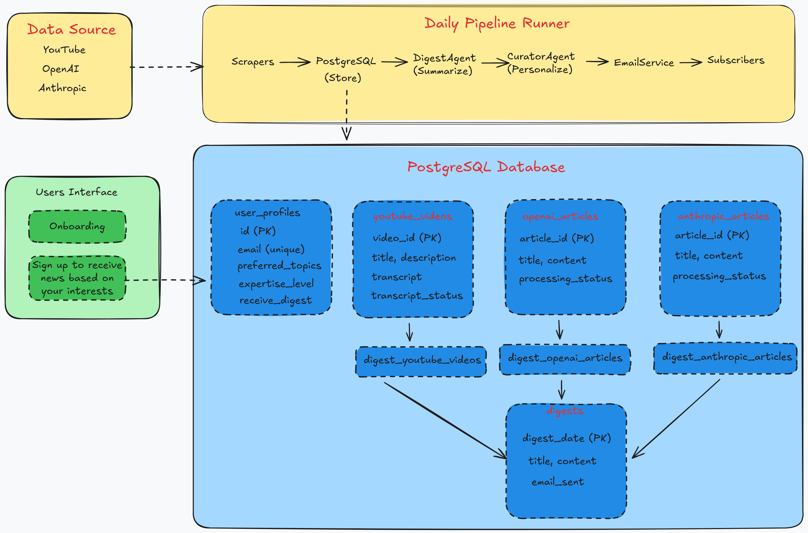

 # AI News Daily: Personalized AI News Aggregator
[](https://www.python.org/downloads/release/python-3120/)
 [](https://opensource.org/licenses/MIT)
[](https://your-app-url.railway.app)

> A full-stack AI-powered news aggregator that automatically collects, processes, and summarizes content from AI-focused sources (OpenAI, Anthropic, YouTube channels) and delivers personalized daily email digests.

[**Register for Digest**](https://web-production-d5e6d.up.railway.app/) 

## Demo Video

Watch the demo video to see AI News Daily in action:


<details>
<summary>Click to view video inline</summary>

<video width="100%" controls>
  <source src="static/demo_ai-news-daily.mp4" type="video/mp4">
  Your browser does not support the video tag. <a href="static/demo_ai-news-daily.mp4">Download the video</a> instead.
</video>

</details>

---
## Overview 
AI News Daily is a sophisticated full-stack application that demonstrates expertise in modern Python 
development, AI integration, automated systems, and cloud deployment. The system implements a multi-stage 
pipeline that continuously scrapes, processes, and personalizes AI-related content for subscribers.

### Key Features
- **Multi-source Aggregation**: Collects content from YouTube, OpenAI, and Anthropic RSS feeds
- **AI-Powered Processing**: Summarizes content using OpenAI's GPT models
- **Personalized Curation**: Ranks and filters content based on user preferences
- **Automated Delivery**: Sends personalized daily digest emails
- **User Management**: Self-service registration and preference management
- **Production-Ready**: Deployed on Railway with PostgreSQL and automated scheduling

## Tech Stack
 
### Backend & Data Processing
- **Python 3.12+** - Modern Python development
- **SQLAlchemy 2.0+** - Database ORM with PostgreSQL
- **Feedparser** - RSS feed parsing
- **YouTube Transcript API** - Video transcript extraction
- **OpenAI API** - Content summarization and personalization
- **Pydantic** - Data validation and settings management

### Web Interface & User Experience
- **Streamlit** - Interactive web UI for user registration
- **SQLAlchemy Repository Pattern** - Clean data access layer

### Infrastructure & Deployment
- **PostgreSQL** - Production-grade database
- **Railway** - Cloud deployment platform
- **Docker** - Containerization support
- **SMTP** - Email delivery service integration

### Architecture
- **Multi-stage Pipeline**: Scrape → Process → Digest → Curate → Email
- **Repository Pattern**: Clean separation of data access logic
- **AI Agent System**: Modular AI processing components
- **Configuration Management**: Pydantic-based settings with environment variable support

---

## System Architecture

AI News Daily follows a **modular pipeline architecture** with clear separation between data collection, processing, and delivery layers.





### Pipeline Stages
1. **Scraping**: Collect content from RSS feeds and YouTube channels
2. **Processing**: Extract transcripts, convert HTML to markdown
3. **Digest Creation**: Use AI agents to summarize and aggregate content
4. **Curation**: Rank content based on user preferences
5. **Email Delivery**: Send personalized daily digests

---

## Key Technical Features

### 1. Advanced Data Architecture
- **SQLAlchemy Models** with custom enums and constraints
- **Repository Pattern** implementation for clean data access
- **Connection Pooling** and session management
- **Database Migration Ready** (using SQLAlchemy metadata)

### 2. AI Integration
- **OpenAI API** integration with error handling and retry logic
- **Token Management** with chunking for large content
- **Structured Prompts** for consistent AI outputs
- **Fallback Mechanisms** when AI calls fail

### 3. Automated Scheduling
- **Background Task Processing** for daily digest generation
- **Rate Limiting** and error handling for API calls
- **Comprehensive Logging** for monitoring and debugging

### 4. User Personalization
- **Preference-Based Filtering** using configurable topics
- **Content Ranking** based on user interests
- **Provider Preferences** for source selection
- **Expertise Level** matching for appropriate content complexity


---

## Quick Start 

```bash
# 1. Clone and setup
git clone <your-repo-url> ai-news-daily && cd ai-news-daily
python -m venv .venv && source .venv/bin/activate  # or .\.venv\Scripts\activate on Windows
pip install -e .

# 2. Start database with Docker Compose
docker-compose -f docker/docker-compose.yml up -d

# 3. Configure environment
cp example.env .env
# Edit .env and set: GEMINI_API_KEY, SMTP_*, etc.
# DATABASE_URL is already set correctly for Docker Compose

# 4. Initialize database (via Streamlit app)
streamlit run user_app.py
# Complete onboarding to create your first subscriber profile

# 5. Run the daily pipeline
python -m app.daily_runner
```

## Running the System

### 1. User Onboarding App (Streamlit)

This app is what end‑users see to subscribe and set their preferences.

```bash
streamlit run user_app.py
```

Features:
- Explains what AI News Daily is and how it works
- Collects name, email, topics, providers, formats, expertise, timezone
- Validates email format
- Saves a `UserProfile` record in the database
- Starts a lightweight background scheduler (`run_daily_digest_job`) to trigger the pipeline once per day (7 AM UTC by default)

### 2. Admin App (Streamlit)

This app is for internal use (operators/maintainers).

```bash
streamlit run admin_app.py
```

Features:
- Dashboard with statistics (total users, subscribers, expertise distribution)
- Add new user profiles
- List, search, filter users
- Edit or delete existing users


### 3. Daily Pipeline Runner (CLI)

The **core orchestrator** is `DailyPipelineRunner` in `app/daily_runner.py`.  
You can run the full pipeline from the command line:

```bash
python -m app.daily_runner            # uses today's date
python -m app.daily_runner 2025-01-31 # run for a specific date (YYYY-MM-DD)
```

The pipeline stages:
1. **Scraping** – calls `run_scraping_only(config)` to collect new content from YouTube / OpenAI / Anthropic.  
2. **Content collection** – loads recent content from the database repositories.  
3. **Digest generation** – uses `DigestAgent` to generate a consolidated digest for the target date.  
4. **Email delivery** – for each subscriber:
   - `CuratorAgent` selects relevant items  
   - `EmailService` builds and sends a personalized email  

The CLI prints a structured summary at the end (counts of items, emails sent/failed, etc.).

---

## Deployment

Deployed on [Railway](https://railway.app) with:
- PostgreSQL database
- Automatic build and deployment
- Environment variable management
- 24/7 uptime with monitoring


